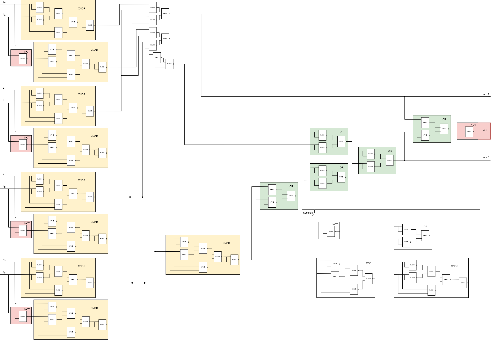
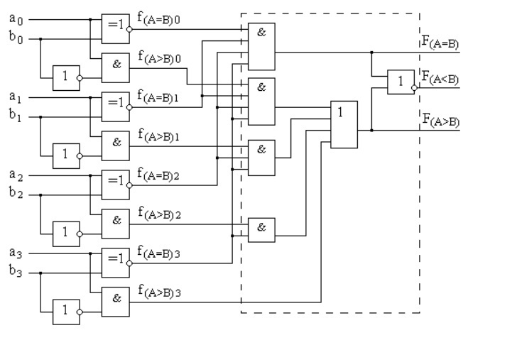

<h2 align=center>Лабораторная работа 1</a> </h2>

#### Вариант 2

| Логический базис | БОЭ |
| :-------: | :- |
| NAND | Полный четырехразрядный компаратор |

#### Цели работы

1. Получить базовые знания о принципах построения цифровых интегральных
схем с использованием технологии КМОП.
2. Познакомиться с технологией SPICE-моделирования схем на транзисторах.
3. Получить навыки описания схем базовых операционных элементов (БОЭ) комбинационного типа на вентильном уровне с использованием языка описания
аппаратуры Verilog HDL.

#### Выполнение 

**Схема компаратора в логическом базисе NAND**

**Схема компаратора**

#### Вывод

В результате выполнения данной лабораторной работы нами был реализован четырехразрядный сумматор, а также изучены основы синтаксиса языка Verilog.

Также в результате выполнения данной работы мы сделали вывод, что реализация схемы в базисе NAND не всегда оптимальна. 

