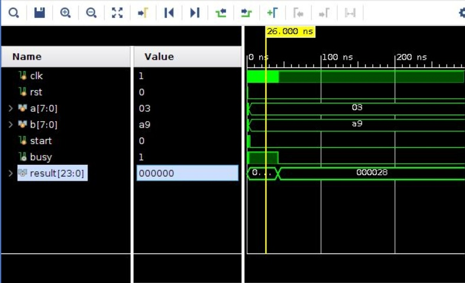
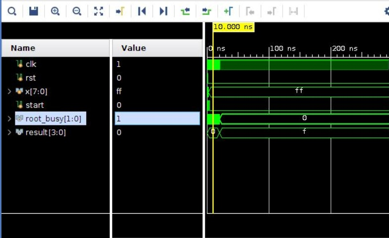
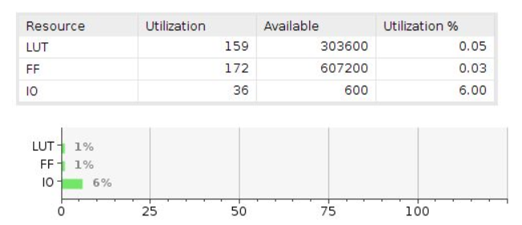
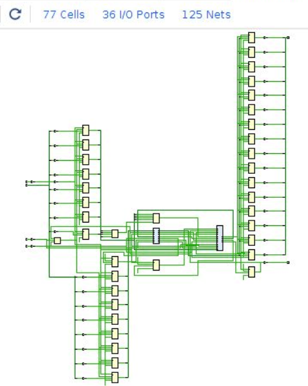

# Лабораторная работа №3 &laquo;Функциональная схемотехника&raquo;

Выполнили: Артур Куприянов, Екатерина Машина

Преподаватель: Тищук Б.Ю.

Санкт-Петербург, 2021

Задание
=======

Получить навыки разработки цифровых устройств на базе программируемых логических интегральных схем (ПЛИС).

Вариант
=======

* `y = a^3 + sqrt(b)`

Область допустимых значений и область представления данных
===================

**Область представления**

* `a`,`b` - положительные 8 битные чила в двоичной системе счисления
* `y` - положительное 24 битное число в двоичной системе счисления 

**Область допустимых значений**

* 0 <= `a`,`b` <= FF
* 0 <= `y` <= FD030F

Описание работы алгоритма
===================

1. Вычисление куба числа `a`
2. Квадратного корня из числа `b`
3. Вычисление суммы результатов пунктов 1 и 2

Руководство пользователя
========================

1. Ввести входные данные для **a** (первые 8) и **b** (следующие 8)

2. При необходимости нажать на кнопку reset для сброса состояния

3. Нажать кнопку start

4. Посмотреть результат работы в LED-лампочках (7)

Описание модуля на языке Verilog HDL
====================================
* <a href="./src/function.v">`function.v`</a>
* <a href="./src/cube.v">`cube.v`</a>
* <a href="./src/mult.v">`mult.v`</a>
* <a href="./src/root.v">`root.v`</a>

Тестовое окружение
==================
* <a href="./test/main_function.v">`main_function.v`</a>
* <a href="./test/cube_tb.v">`cube_tb.v`</a>
* <a href="./test/root_tb.v">`root_tb.v`</a>

Временная диаграмма
===================
Ниже представлены временные диаграммы для первого и второго тестов. Из первой диагрммы видно, что на вычисление одного значения (при тактовой частоте 100 МГц) уходит 1240 нс.

Потребление ресурсов на FPGA
============================

Замеры потребления ресурсов FPGA были сделаны в симуляторе Vivaldo HDL.

Схема устройства
========================

Вывод
=====

В ходе выполнения работы была создана последовательностная схема ускорителя математических вычислений для ПЛИС.
