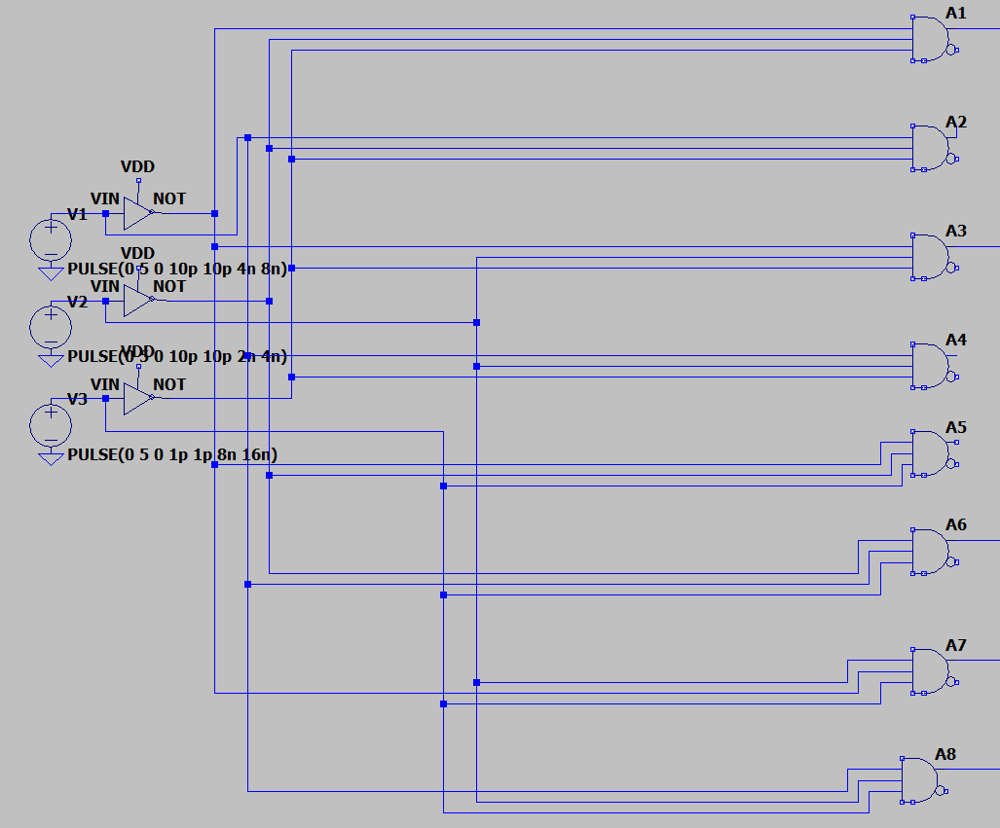
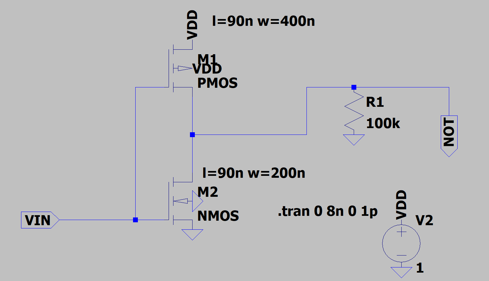
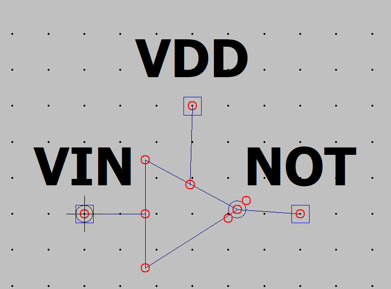
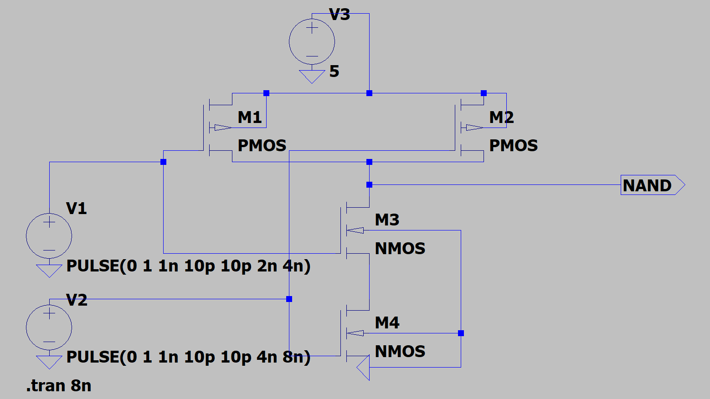
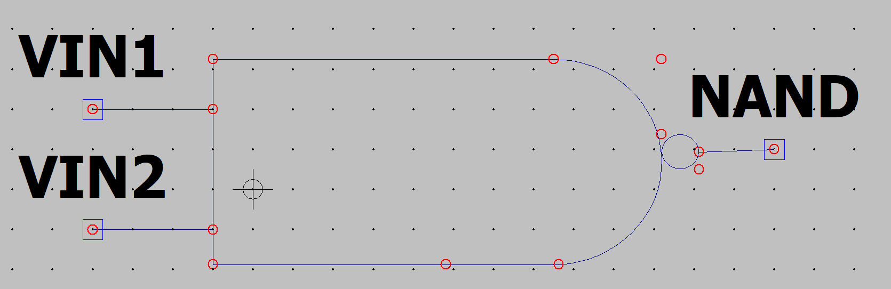
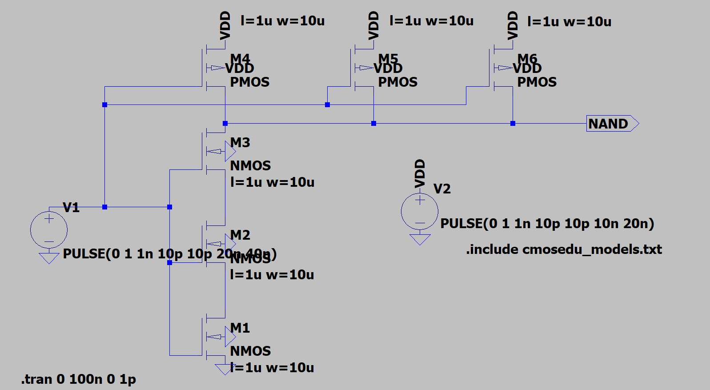
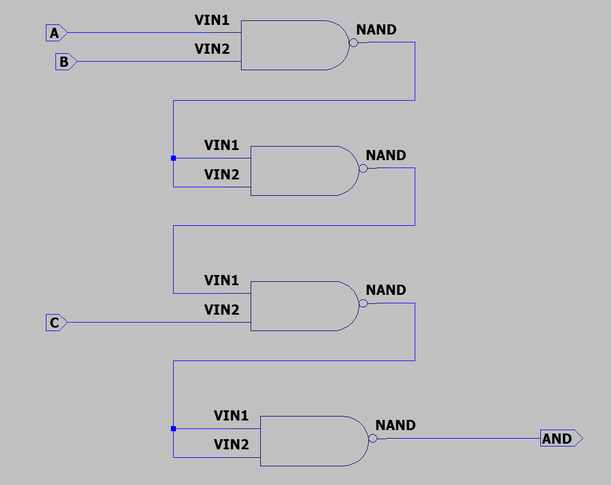
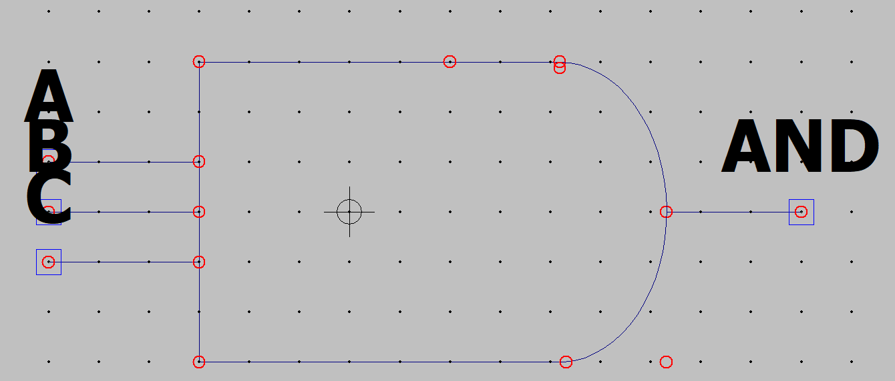
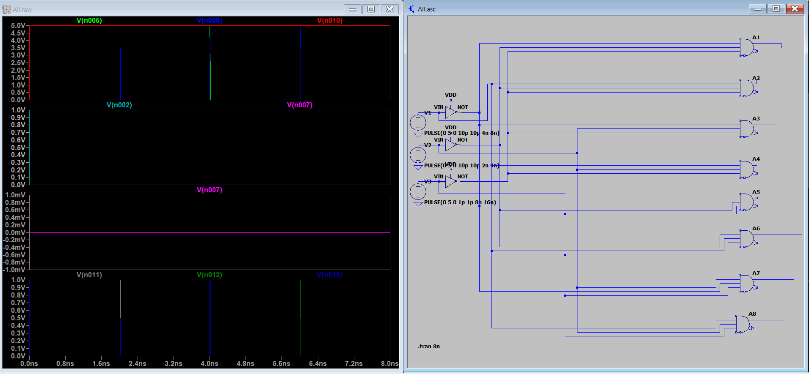

# Лабораторная работа №4 &laquo;Функциональная схемотехника&raquo;

Выполнили: Артур Куприянов, Екатерина Машина

Преподаватель: Тищук Б.Ю.

Санкт-Петербург, 2021

Задание
=======

1. Постройте в LTspice на транзисторах схему вентиля, составляющего основу логического базиса согласно варианту задания.
2. Создайте символ для разработанного вентиля как иерархического элемента.
3. С использованием созданного иерархического элемента постройте схему тестирования вентиля.
4. Проведите моделирование работы схемы и определите задержку распространения сигнала через тестируемый вентиль.
5. Определите максимальную частоту изменения входных сигналов, при которой
построенная схема сохраняет работоспособность.
6. Постройте БОЭ на базе созданного вентиля согласно варианту задания.
7. Создайте символ для построенного БОЭ.
8. Проведите моделирование работы схемы и определите задержку распространения сигнала через БОЭ.

Вариант
=======

* Позиционный дешифратор «3 в 8»  базиве NAND

Созданные схемы
===================
Полная схема дешифратора

Инвертор

NAND

NAND на 3 входа

AND на 3 входа

Временная диаграмма
===================

Вывод
=====

В ходе выполнения работы мы познакомились с системой LTspice и создали дешифратор с использованием транзистеров.